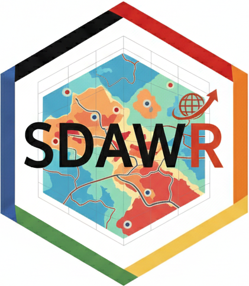

### 01:450:320 | Spring 2026 | Updated on: `r Sys.Date()`

::: {style="padding: 5px 15px; background: #f8f9fa; border-left: 5px solid #cc0033; width: fit-content; margin-bottom: 20px;"}
**Instructor:** [Lei Song](mailto:your-email@rutgers.edu)   
**Teaching Assistant:** TBD   
**Time:** Mon and Wed, 3:50PM - 5:10PM   
**Location:** Lucy Stone Hall (LSH-B266), Livingston campus
::: 

## Getting start!

Please read the Syllabus to get yourself familiar with this course, and read the tutorials to set yourself up for the course.

-   [Syllabus](syllabus.html)
-   [Assessment Criteria](assessment.html)
-   [Software installation](software-installation.html)
-   [Git/GitHub](git-github.html)

## Resources

These resources are helpful that you will reference back and forth for the whole semester.

-   [Helpful functions](helpful_functions.html)
-   [Cheatsheets](cheatsheets.html)

## Course materials

The class materials were designed by Lyndon Estes and Lei Song.

-   [Unit 1](unit1.html) - Fundamentals of R programming
    -   [Module 1](unit1-module1.html) - Reproducibility and related R skills
    -   [Module 2](unit1-module2.html) - R and R fundamentals
    -   [Module 3](unit1-module3.html) - Data preparation and operation
    -   [Module 4](unit1-module4.html) - Data manipulation and visualization
-   [Unit 2](unit2.html) - Handling and analyzing spatial data
    -   [Module 1](unit2-module1.html) - Vector data
    -   [Module 2a](unit2-module2a.html) - Raster data, part 1
    -   [Module 2b](unit2-module2b.html) - Raster data, part 2
-   [Potential Projects](projects.html)

## Course Schedule (Subject to change)

<table class="table" style="width:100%;">
  <thead>
    <tr>
      <th style="width: 75px; text-align: center;">Week</th>
      <th style="width: 140px;">Date</th>
      <th style="width: 300px;">Topic</th>
      <th style="width: 160px;">Slides</th>
      <th style="width: 220px;">Deadlines</th>
    </tr>
  </thead>
  <tbody>
    <tr style="background-color: #f8f9fa; font-weight: bold;">
      <td colspan="5" style="text-align: center; border-bottom: 2px solid #cc0033;">UNIT 1: FUNDAMENTALS OF R PROGRAMMING</td>
    </tr>
    <tr>
      <td style="text-align: center;">1</td>
      <td>Jan 21</td>
      <td>Setup</td>
      <td>Class 1</td>
      <td></td>
    </tr>
    <tr>
      <td style="text-align: center;">2</td>
      <td>Jan 26, 28</td>
      <td>Continued setup; Git & GitHub</td>
      <td>Class 2, Class 3</td>
      <td></td>
    </tr>
    <tr>
      <td style="text-align: center;">3</td>
      <td>Feb 2, 4</td>
      <td>R Ecosystem & R Markdown</td>
      <td>Class 4, Class 5</td>
      <td style="color: #cc0033; font-weight: bold;">Assignment 1</td>
    </tr>
    <tr>
      <td style="text-align: center;">4</td>
      <td>Feb 9, 11</td>
      <td>Data structures, OOP, Env, Control flow</td>
      <td>Class 6, Class 7</td>
      <td></td>
    </tr>
    <tr>
      <td style="text-align: center;">5</td>
      <td>Feb 16, 18</td>
      <td>Week 4 continued</td>
      <td>Class 8, Class 9</td>
      <td style="color: #cc0033; font-weight: bold;">Assignment 2</td>
    </tr>
    <tr>
      <td style="text-align: center;">6</td>
      <td>Feb 23, 25</td>
      <td>tidyverse, working with data</td>
      <td>Class 10, Class 11</td>
      <td></td>
    </tr>
    <tr>
      <td style="text-align: center;">7</td>
      <td>Mar 2, 4</td>
      <td>Data manipulation</td>
      <td>Class 12, Class 13</td>
      <td style="color: #cc0033; font-weight: bold;">Assignment 3</td>
    </tr>

    <tr style="background-color: #f8f9fa; font-weight: bold;">
      <td colspan="5" style="text-align: center; border-bottom: 2px solid #cc0033; padding-top: 20px;">UNIT 2: HANDLING AND ANALYZING SPATIAL DATA</td>
    </tr>
    <tr>
      <td style="text-align: center;">8</td>
      <td>Mar 9, 11</td>
      <td>Working with vectors</td>
      <td>Class 14, Class 15</td>
      <td></td>
    </tr>
    <tr class="text-muted">
      <td style="text-align: center;">9</td>
      <td>Mar 16-20</td>
      <td colspan="3" style="text-align: center; letter-spacing: 5px;">SPRING BREAK - NO CLASS</td>
    </tr>
    <tr>
      <td style="text-align: center;">10</td>
      <td>Mar 23, 25</td>
      <td>More on vectors</td>
      <td>Class 16, Class 17</td>
      <td style="color: #cc0033; font-weight: bold;">Assignment 4</td>
    </tr>
    <tr>
      <td style="text-align: center;">11</td>
      <td>Mar 30, Apr 1</td>
      <td>Raster algebra, terrain</td>
      <td>Class 18, Class 19</td>
      <td></td>
    </tr>
    <tr>
      <td style="text-align: center;">12</td>
      <td>Apr 6, 8</td>
      <td>Raster algebra, terrain continued</td>
      <td>Class 20, Class 21</td>
      <td style="color: #cc0033; font-weight: bold;">Assignment 5</td>
    </tr>
    <tr>
      <td style="text-align: center;">13</td>
      <td>Apr 13</td>
      <td>Oral defense</td>
      <td>Project Drafts</td>
      <td></td>
    </tr>
    <tr class="text-muted">
      <td style="text-align: center;">13-15</td>
      <td>Apr 15 onwards</td>
      <td colspan="3" style="text-align: center; letter-spacing: 5px;">FINAL PROJECT CONSULTATION</td>
    </tr>
    <tr>
      <td style="text-align: center;">16</td>
      <td>May 4</td>
      <td>Final project presentation</td>
      <td>Your slides!</td>
      <td style="color: #cc0033; font-weight: bold;">Final Project Due 11 May</td>
    </tr>
  </tbody>
</table>
