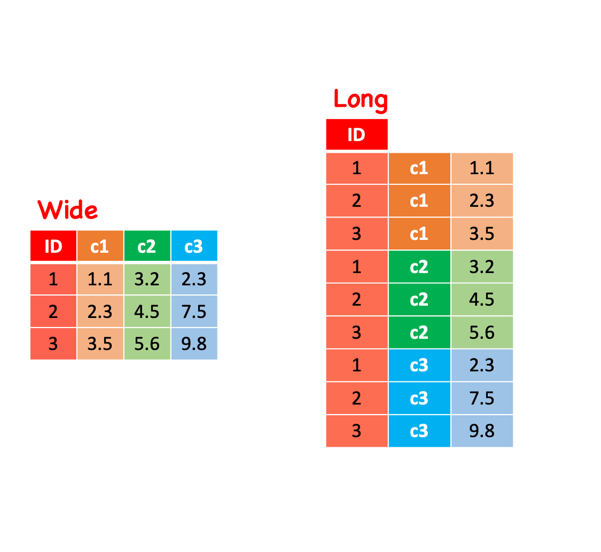

## We have learned

- Fundamentals of R.
- Functions, packages, environment, and namespace.
- Reproducibility.
- Getting help.
- Git/GitHub
- Indexing, subsetting, and replacing
- `*apply` family
- tidy data and `tidyverse`

The answer for all the in-class practices so far: [code_cracker1_answer.Rmd](https://sselp.github.io/sdawr//code_cracker1_answer.Rmd).

I have updated answers for previous [homework](https://lei-song.shinyapps.io/SDA320-homework/#section-tropical-birding).

## Today

- Read, write data and paths
- Data combining
- Data reshaping and renaming
- Data summaries

## Directory vs. file

dir (folder): 

- Full path:

  - `/Users/leisong/sdawr`
  - `C:\Users\lsong\ls320`
  
- Relative path (relative to the working directory):

  - `R`
  - `vignettes`

file: 

- `/Users/leisong/sdawr/README.md` (full path)
- `vignettes\unit1_module1.Rmd` (relative path)

## Your turn

Using your package as the example, give me **four** paths:

- A full path of the folder "R" in your package.
- A relative path of the folder "man" in your package.
- A full path of the file "my_calc.R" in your package.
- A relative path of the file "my_calc.md" in your package.

**Post your answers in Google chat.**

## Paths

- Interactive environment (e.g. console):
  
  - `getwd()` to get the working directory
  - `setwd()` to set the new working directory
  - relative paths are relative to this working directory.

- R markdown knit directory:

  - Document directory
  - Project directory
  - Current working directory
  
- R script

  - Current working directory
  
## Strategies to work with paths

Package `here` will definitely what you should try.

- Function `here` of package `here` will specify the right path of a file within a project:
  
  - `here::here()` will give you the project root path
  - `here::here("/a/path/relative/to/your/project/root")` to specify the right path of a file within your package.

## Strategies to work with paths
  
- Check, create, or delete directory/file

  - `dir.exists()` and `file.exists()` to check if a directory or file exists.
  - `dir.create()` to create a directory.
  - `file.remove()` or `file.rename()` to delete or rename a file.
  
- List files/folders within a directory:

  - `list.files()` to list files with arguments `pattern` or `full.names` based on needs. 
  
    - E.g. `list.files('dir_path', pattern = 'csv$', full.names = T)`.
  - `list.dirs()` to list folders. Works similar to `list.files()`.

## Read and write data
  
- `read.csv` to read csv file
- `write.csv` to save csv file
  
```{r}
#| echo: true
#| eval: false

# Base R
something <- read.csv("/path/to/the/file", stringsAsFactors = FALSE)
write.csv(something, "/path/for/the/new/file", row.names = FALSE)
```

The path can be either a local file path or a web (online) URL.

- `file.path` to construct a path, e.g, 

```{r}
#| echo: true
#| eval: true

fname <- file.path("/Users/leisong/sdawr", "new_script.R")
fname
```
  
## Practice 1

- Download the crop recommendation file by right clicking [here](https://sselp.github.io/sdawr//Crop_recommendation.csv).
- Put it under your **class note folder**.
- Use code to create a new folder **crops** under **class note folder**.
- Split the crop recommendation table into sub-tables by crop types and save them to new **crops** folder as csv files.

```{r}
#| echo: false
#| eval: true

library(here)
library(dplyr)

# Read table
crops <- read.csv(here('docs/Crop_recommendation.csv'))

# Split the table
dir.create(here('your_class_note/crops'), recursive = TRUE)
files <- sapply(unique(crops$label), function (crop_type){
  crops %>% filter(label == crop_type) %>% 
    write.csv(file.path(here('your_class_note/crops'), paste0(crop_type, '.csv')))
  file.path('crops', paste0(crop_type, '.csv'))
})
names(files) <- NULL
files[1:9]
```

Hints:

  - Packages: `here`, `dplyr`
  - Useful function: `read.csv`, `dir.create`, `sapply`, `file.path`, `write.csv`.
  - Hint for the path: `file.path(here('your_class_note/crops'), paste0(crop_type, '.csv'))`

## Practice 2

Now let's do reverse: 

- read all sub-tables in **crops** folder and merge them back to a whole table and 
- save out as a new file in your **class note folder** named as "crop_yourname.csv".

  - Useful function: `list.files`, `read.csv`, `*apply`, `write.csv`.
  - The magic of `do.call()`, `rbind` and `lapply`.
  
```{r}
#| echo: false
#| eval: false

library(here)
library(dplyr)

# Split the table
files <- list.files(here('your_class_note/crops'), full.names = TRUE)
crops <- do.call(rbind, lapply(files, function (file){
  read.csv(file)
}))
write.csv(crops, here("your_class_note/crop_lsong.csv"), row.names = FALSE)
```

## Data combining

- `*_join` function in `dplyr` package.

Create the example data
 
```{r}
#| echo: true
#| eval: true
#| 
set.seed(10)
crop_rmd <- read.csv(here('docs/Crop_recommendation.csv')) %>% 
    sample_n(size = 20)

crop_rmd_weather <- crop_rmd %>% 
  select(label, temperature, humidity, rainfall)

crop_rmd_soil <- crop_rmd %>% 
  select(label, N, P, K, ph) %>% 
  slice(1:18)
```
\

Run these lines to observe differences

```{r}
#| echo: true
#| eval: false
#| 
left_join(crop_rmd_weather, crop_rmd_soil, by = 'label')
right_join(crop_rmd_weather, crop_rmd_soil, by = 'label')
inner_join(crop_rmd_weather, crop_rmd_soil, by = 'label')
full_join(crop_rmd_weather, crop_rmd_soil, by = 'label')
```

## Data reshaping

- `pivot_longer()` in `tidyr` package.
- `pivot_wider()` in `tidyr` package.

## Data reshaping

```{r, out.width = "75%", echo=FALSE, fig.align='center'}

```

## Practice

- Make the crop recommendation data to longer like this:

```{r}
#| echo: false
#| eval: true

library(tidyr)
crop_rmd %>% 
    pivot_longer(1:7, names_to = "variable", values_to = "value") %>% 
    head(5)
```

- Then convert it back.

## Renaming

- `rename()` in `dplyr` package.

```{r}
#| echo: true
#| eval: true
#| 
crop_rmd <- crop_rmd %>% rename(precipitation = rainfall)
head(crop_rmd)
```

## Summarizing

- `group_by` and `summarize` in `dplyr` package.

```{r}
#| echo: true
#| eval: true
#| 
tp_mean <- crop_rmd %>% 
    group_by(label) %>% 
    summarise(temp_mean = mean(temperature),
              precp_mean = mean(precipitation))
tp_mean
```

## Summarizing

- More `summarize` functions.

```{r}
#| echo: true
#| eval: true
#| 
# Another example
all_mean <- crop_rmd %>% 
    group_by(label) %>% 
    summarise_at(c('temperature', 'humidity', 'precipitation',
                 'N', 'P', 'K', 'ph'), mean)
all_mean
```

## Homework

- Assignment 3 due this week.
- **Important:** [Weekly homework](https://lei-song.shinyapps.io/SDA320-homework/#section-spotted-hyenas-distribution) (Spotted Hyenas Distribution).
