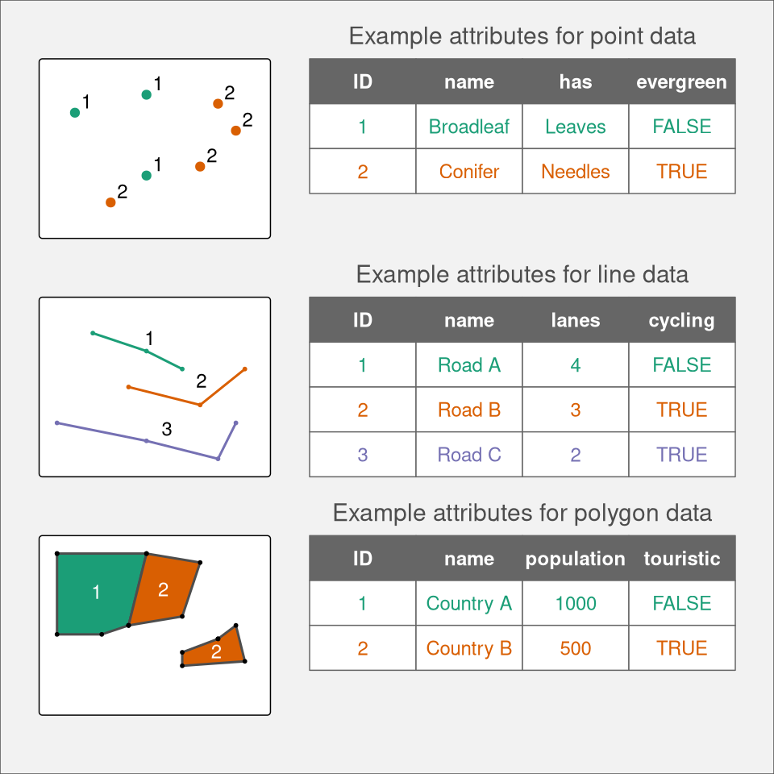
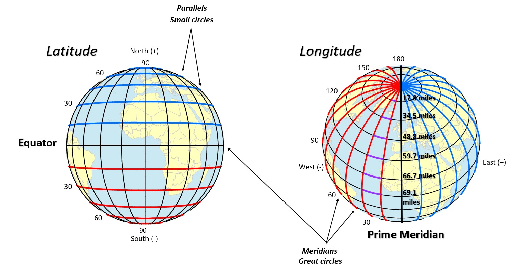
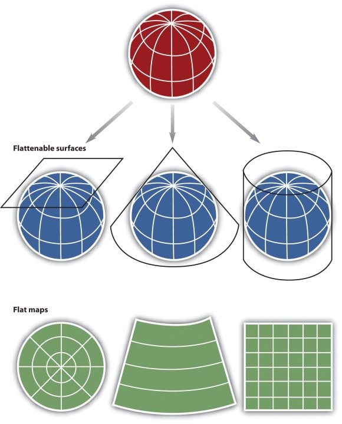

## We have learned

- We have done Unit 1.
- From this class, we will learn spatial.

I have updated answers for all homework tasks.

## Today

Review some concepts of vector data:

  - Common file types.
  - Basic elements of vector data.

Geometry creation

```{r}
#| echo: false
#| eval: true

library(dplyr)
library(here)
library(sdadata)
```

## Common feature types

- `POINT` and `MULTIPOINT`
- `LINESTRING` and `MULTILINESTRING`
- `POLYGON` and `MULTIPOLYGON`

```{r, out.width="120%", echo=FALSE, fig.align='center'}

```

## Common file types

- Non-spatial text file (e.g. `.csv` or `.xlsx`)
- ESRI Shapefile (`.shp`)
- GeoJSON or KML (`.geojson` or `.kml`)
- `st_drivers(what = "vector")` to check all supported types

## Read and write vector data

```{r}
#| echo: true
#| eval: false

library(sf)
library(sdadata)

# Read vector
fname <- system.file('extdata/districts.geojson', package = 'sdadata')
districts <- st_read(fname)
head(districts)

# Write vector
st_write(districts, "Your_class_note/districts.shp")
```

**Observe how many new files saved.**

## Basic elements of vector data

- `.shp` stores the actual geometry (`.shx` is the index)
- `.dbf` stores the attribute data (or database)
- `.prj` stores coordinate reference system (CRS) or projection.

## Attributes (database) of vectors

```{r}
#| echo: true
#| eval: true
#| warning: false
#| message: false

library(sf)
library(sdadata)

# Read vector
fname <- system.file('extdata/districts.geojson', package = 'sdadata')
districts <- st_read(fname, quiet = TRUE)
head(districts)

# Drop the geometry, just keep the attributes
head(districts %>% st_drop_geometry())
```

## Coordinate reference system

```{r}
#| echo: true
#| eval: true
#| warning: false
#| message: false
#| 
head(districts, 1)

# Query the crs
st_crs(districts)
```

## Coordinate reference system

- Geographic coordinate systems (EPSG:4326), in longitude and latitude

```{r, out.width="100%", echo=FALSE, fig.align='center'}

```

## Coordinate reference system

- Projected coordinate reference system, in meters or other units

```{r, warning=F, message=F, echo=F, fig.align='center', fig.asp = 0.6, fig.width = 14, out.width = "50%"}
library(rnaturalearth)
library(ggplot2)
spdf_world <- ne_countries() %>% st_as_sf()
spdf_world %>% ggplot() +
  geom_sf(fill = 'aliceblue', size = 1.1) +
  theme_minimal()
```

## Projection and transformation

```{r, out.width="100%", echo=FALSE, fig.align='center'}

```

## How projections can lie to you?

```{r, results='asis'}
library(vembedr)
embed_url("https://www.youtube.com/watch?v=KUF_Ckv8HbE&t=128s")
```

## Projection

- EPSG code, e.g. 4326 for WGS84
- WKT text, e.g. result of `st_crs(districts)`

[List of ESPG codes on spatialreference.org](https://spatialreference.org/ref/epsg/)

## Transformation

- `st_transform`

- (Pseudo-)Cylindrical: Mercator (EPSG:3857), Robinson (ESRI:54030)
- Conical: USA Contiguous Albers Equal Area (EPSG:5070)
- Planar: Lambert Azimuthal Equal-Area projection (EPSG:3035)

```{r}
#| echo: true
#| eval: false

library(rnaturalearth)
library(ggplot2)

world <- ne_countries() %>% select(name)

# Unprojected (Longitude/Latitude)
world %>% ggplot() +
  geom_sf(fill = 'aliceblue') +
  theme_minimal()

# Change the projection codes to check different projections
world %>% st_transform("EPSG:3035") %>% 
    ggplot() +
    geom_sf(fill = 'aliceblue') +
    theme_minimal()
```

## Transformation

If no CRS, we can set set one.

```{r}
#| echo: true
#| eval: false
#| 
st_set_crs(districts, 4326) # set 
st_crs(districts) <- 4326
st_crs(districts) <- st_crs(world) # or a crs object
```

**BUT if CRS is not NA, we must use `st_transform` to reproject.**

## Creation - point

```{r}
#| echo: true
#| eval: false
b266_sfg <- st_point(c(-74.435060, 40.521077))
b266_sfg; class(b266_sfg) # sfg, simple feature geometry
b266_sfc <- st_sfc(b266_sfg)
b266_sfc; class(b266_sfc) # sfc, simple feature column, geospatial already
st_crs(b266_sfc) <- 4326 # set CRS for geopsatial, EPSG code
b266_sfc
b266_pt <- st_sf(b266_sfc) # sf, simple feature collection
b266_pt; class(b266_pt)
attr(b266_pt, "sf_column") # check sfc
b266_geom <- st_geometry(b266_pt) # get sfc

identical(b266_sfc, b266_geom) # st_geometry gets sfc from a sf data.frame
```

Try to create `b266_pt` with one single pipeline.

## Creation - multipoint

`multipoint` is only one geometry for multiple points.

```{r}
#| echo: true
#| eval: false
coords <- rbind(c(40.522340, -74.435752),
                c(40.522296, -74.435594),
                c(40.522351, -74.435456),
                c(40.522058, -74.434914),
                c(40.521882, -74.435069),
                c(40.521109, -74.434980),
                c(40.521150, -74.435071),
                c(40.520980, -74.435245),
                c(40.520842, -74.435011),
                c(40.521023, -74.434842),
                c(40.521117, -74.434687),
                c(40.521936, -74.434735),
                c(40.522093, -74.434554),
                c(40.522780, -74.435722))
coords <- coords[, c(2, 1)]
lucy_stone_mpt <- st_multipoint(coords[, ]) %>% # create sfg
  st_sfc() %>% st_set_crs(4326) %>% # create sfc
  st_sf() # build up sf
lucy_stone_mpt
plot(lucy_stone_mpt %>% st_geometry()) # plot
```

## Creation - points

```{r}
#| echo: true
#| eval: false
lucy_stone_mpt <- do.call(
    st_sfc, lapply(1:nrow(coords), function(n){
        st_point(coords[n, ]) # create sfg for each point
    })) %>% st_set_crs(4326) %>% # create sfc
    st_sf() # build up sf
lucy_stone_mpt
plot(lucy_stone_mpt %>% st_geometry()) # plot
```

## `st_as_sf` function

```{r}
#| echo: true
#| eval: false
dt_url <- 'https://sselp.github.io/sdawr//hyenas_occurrence.csv'
occurrence <- read.csv(dt_url, stringsAsFactors = F) %>% 
  dplyr::select(gbifID, decimalLatitude, decimalLongitude) %>% 
  st_as_sf(coords = c('decimalLongitude', 'decimalLatitude'),
           crs = 4326)
plot(occurrence %>% st_geometry()) # plot
```

## Creation - linestring

```{r}
#| echo: true
#| eval: false
lucy_stone_l <- st_linestring(coords) %>% # create sfg
  st_sfc() %>% st_set_crs(4326) %>% # create sfc
  st_sf() # build sf
lucy_stone_l # Just one geometry
plot(lucy_stone_l %>% st_geometry())
```

## Creation - linestrings

```{r}
#| echo: true
#| eval: false
lucy_stone_ls <- do.call(
    st_sfc, lapply(1:(nrow(coords) - 1), function(n){
  # create sfg for each straight line
  st_linestring(coords[n:(n + 1), ])
})) %>% st_set_crs(4326) %>% # create sfc
  st_sf() # build up sf
lucy_stone_ls
plot(lucy_stone_ls %>% st_geometry()) # plot
```

## Creation - multilinestring

`multilinestring` is only one geometry for multiple linestrings.

```{r}
#| echo: true
#| eval: false
lucy_stone_ml <- st_multilinestring(list(coords)) %>% 
  st_sfc() %>% st_set_crs(4326) %>% # create sfc
  st_sf() # build up sf
lucy_stone_ml
plot(lucy_stone_ml %>% st_geometry()) # plot
```

## Creation - polygon

```{r}
#| echo: true
#| eval: false
coords <- rbind(c(40.522340, -74.435752),
                c(40.522296, -74.435594),
                c(40.522351, -74.435456),
                c(40.522058, -74.434914),
                c(40.521882, -74.435069),
                c(40.521109, -74.434980),
                c(40.521150, -74.435071),
                c(40.520980, -74.435245),
                c(40.520842, -74.435011),
                c(40.521023, -74.434842),
                c(40.521117, -74.434687),
                c(40.521936, -74.434735),
                c(40.522093, -74.434554),
                c(40.522780, -74.435722),
                c(40.522340, -74.435752)) # repeat the first point!!
coords <- coords[, c(2, 1)]
lucy_stone_ply <- st_polygon(list(coords)) %>% # create sfc
  st_sfc() %>% st_set_crs(4326) %>%  # create sfc
  st_sf()
lucy_stone_ply
plot(lucy_stone_ply$geometry)
```

## `st_as_sfc` function

```{r}
#| echo: true
#| eval: false
bbox_ply <- st_bbox(lucy_stone_ply) %>% 
  st_as_sfc() %>% st_sf()
plot(bbox_ply$geometry)
plot(lucy_stone_ply$geometry, add = TRUE, border = "blue")
```

## Convert types: `st_cast` function

Literally we could convert from any type to any type. But be careful of the order. 

- `POINT, MULTIPOINT, LINESTRING, MULTILISTRING, POLYGON, MULTIPOLYGON`. 
- E.g. `POINT` -> `MULTIPOINT` (good) and the opposite (bad).

```{r}
#| echo: true
#| eval: false
#| 
st_cast(lucy_stone_ply, 'POINT') %>% plot(add = TRUE, col = "orange")
```

## Homework

- Read section 1-4 in Unit2-Module1.
- Finish homework ["Livingston building teamwork"](https://lei-song.shinyapps.io/SDA320-homework/#section-livingston-building-teamwork) 
  - Each student creates a assigned geospatial polygon(s) for a building(s) on Livingston campus.
  - Everyone must do it as you will use your polygon(s) in next class.
