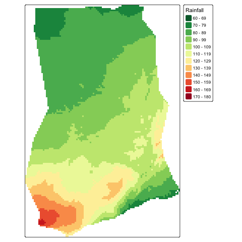

## Project

```{r}
#| echo: false
#| eval: true

library(dplyr)
library(here)
library(sdadata)
sf_use_s2(FALSE)
```

Requirements:

- Project overview: [requirement](https://sselp.github.io/sdawr/projects.html#project-overview-assignment) and [assessment](https://sselp.github.io/sdawr/assessment.html#final-project-overview)
- Project oral defense: [requirement](https://sselp.github.io/sdawr/projects.html#final-project-proposal-oral-defense) and [assessment](https://sselp.github.io/sdawr/assessment.html#final-project-oral-defense)
- Project (presentation and report): [requirement](https://sselp.github.io/sdawr/projects.html#final-project) and [assessment](https://sselp.github.io/sdawr/assessment.html#final-project)

Milestones:

- We do presentation in this room on **May 4, 2026**.
- Final repo is due midnight on **May 11, 2026**.

## Project

Name

- Keep the name short and meaningful (e.g. use `agroclim` for Analyzing agro-climatological data)
- Camel Style (`agroClim`) and special character (`agro_clim`) is also commonly used. But personally I **don't** recommend to use these. Because R is case sensitive, it will increase the risk for the user to misspell it.
- I recommend still using an **R package** style structure, like your assignment repo, to organize the final project.

## Project

Data

- **Raw data**: it is inevitable to use some messy data for your project. If this is the case, you could first clean the raw data and then save out as prepared data for your project.

  - `usethis::use_data_raw(name = 'ghana')`, it will generate a folder and an R file, then you update code here.
  - Run the code will create data folder and generate `rda` file into it.
  - Then you could use these data by using `data(ghana)` in your code. Remember to document your dataset.
  
- **External data**: Store data into `inst` folder (could have sub folders inside). The format is more flexible than raw data.

## Project

Scripts

- **Functions**: don't do duplicated work. If a chunk of code is used more than one time, consider to pack it into a function. I **recommend** to use functions.

- **Vignettes**: use `usethis::use_vignette('Overview')` to create. It is better to customize the format of your vignette.

- If there are other documents (e.g. presentation slides) that you want to include, you could create a folder such as **docs** to store these documents.

## Strategies

Huge files

- Avoid store the files as much as possible. *E.g. use code to download directly.*
- Let git ignore big files (> 100 Mb): list file path into `.gitignore` file. If you accidentally add file into Git  with your most recent commit, do the following to remove it from git track first and then add to `.gitignore`.

  `git rm --cache file_path`
  
   If the file was added in an earlier commit, you need to remove it from the repository's history:
  
  `git filter-branch --force --index-filter 'git rm --cached --ignore-unmatch path/to/giant_file' --prune-empty --tag-name-filter cat -- --all`

## Strategies

Huge files
  
- If there are a lot of such files, removing one by one is tedious. For this case, we could **reset** back to an older commit where you didn't stage the huge files yet. Then delete or ignore these files, stage and commit updates.

  `git reset --soft HEAD~n` (n is the relative number of commit that you want to convert back)
  
- **Note**: There are many useful Git tricks that can help. If you run into trouble, do not get stuck. I am here to help.

## Strategies

Long runtime

If it takes too long to run the code on fly, we could cheat a bit. Save out necessary outputs and load results back. E.g.
  
  - Assume you have a code chunk, set `eval = FALSE` for this chunk to generate result ahead and just show the code in markdown.
  
    ```
    do something here
    obj <- ...
    save(obj, file = 'file_path.rda')
    ```
  - Then add another chunk, set `echo = FALSE` for this chunk to just read the file and not show the code in markdown.
  
    ```
    load('file_path.rda')
    ```

## Strategies

Sometimes, the results are still huge that exceed the file limitation of GitHub. Then we could directly generate result figures. E.g.

```{r}
#| echo: true
#| eval: false
#| warning: false
#| message: false
#| 
library(terra)
library(tmap)
library(dplyr)
library(here)
library(geodata)
library(rnaturalearth)

gha <- ne_countries(continent = 'africa', returnclass = 'sf') %>%
  filter(name == 'Ghana')
rainfall <- worldclim_global(var = "prec", res = 2.5, path = tempdir()) %>% 
  mean(na.rm = TRUE)
rainfall <- mask(crop(rainfall, gha), gha)

png(here('docs/figures/rainfall.png'))
tm_shape(rainfall) + 
  tm_raster(title = 'Rainfall',
            breaks = seq(60, 180, 10),
            palette = "-RdYlGn", 
            n = length(seq(60, 180, 10)))
dev.off()
```

## Strategies

And just show the figures in markdown. E.g.

```{r}
#| echo: true
#| eval: true
#| warning: false
#| message: false
#| 
# set echo=FALSE for this chunk and proper figure dimensions

```

## Strategies

More functions to save out figures. E.g.

- `tmap_save` for `tmap`
- `ggsave` for `ggplot2`

## Strategies

Keep the `main` branch updated. Merge new changes to main branch and test the installation of your package periodically.

Rule of thumb:

- It doesn't make sense to keep work on different branch separately. Create a branch based on the objective, e.g. `prepare_data`. 
- After finishing all work, merge the updates to `main` branch.
- Delete branch `prepare_data`.

Of course, team members could work on different branch simultaneously.

- I suggest team members work on separate files to avoid complex conflicts.

## Class arrangement

- Monday: a time to have a weekly report group by group
- Wednesday: a time of discussion and question
- Office hours: help sections
- We could schedule meetings beyond class time if necessary

## Practice on GitHub

Check the [review of Git/Github](https://sselp.github.io/sdawr/class20_appendix.html). Then let's work on the same repo together now.

- Clone the repo to your local machine.
- Create a new branch based on the objective.
- Open the file `teamwork.Rmd` to add your code.
- Stage and commit your work on this branch.
- Switch branch to main branch and pull the possible new changes.
- Merge changes from your created branch to main branch.
- Push the updated main branch to remote.

*Note:* you may want to delete this toy repo after the class.

## Homework

- Project overview is due this Friday (Apr. 10).
- Let me know which topics or tools (**anything**) you would like me to cover in more detail in future classes, especially those that would be useful for your final projects.
