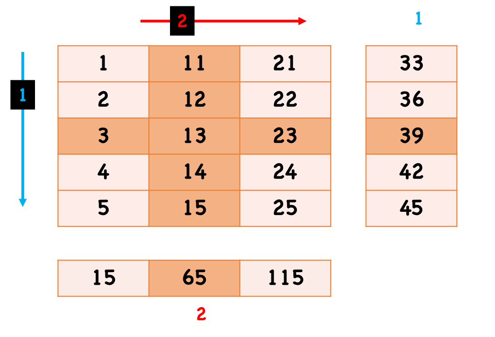
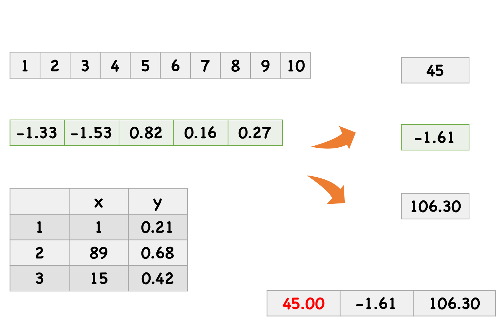

The code for the satellite image:

```{r}
#| echo: true
#| eval: false
library(terra)
library(here)
library(tidyterra)

fname <- file.path(
    here("slides/figures"), 
    "S2A_MSIL2A_20201014T154231_N0214_R011_T19TBG_20201014T200156_20m.tif")
img <- rast(fname)

ggplot() + 
    geom_spatraster_rgb(data = img, r = 4, g = 3, b = 2, stretch = "lin") +
    theme_void()
```

## Today

- Control structure
- Loop functions `*apply`

Open your code cracker [R markdown](https://sselp.github.io/sdawr//code_cracker1.Rmd) in your class note folder.

## Warm up

1. Identify all rows where pH greater than 8 and crop is "chickpea".
2. For only those rows, replace the current rainfall value with the maximum Nitrogen (N) value in this subset.
3. From this subset, randomly select 5 rows with seed 10.
    - Compute: mean(rainfall) + mean(temperature) using those 5 rows.
    - Round the final result to 0.
    - Report the resulting value out loud once you finish.

## Control structure

Commonly used control structure:

- `if` and `else`, which test a condition and do things correspondingly.
- `switch`, which branches 
- `for`, which execute a loop for a specific number of times.
- `while`, which execute a loop when a condition is true.
- `repeat`, which execute a repeat work until break out the loop.
- `break`, which can control to exit a loop.
-  `next`, which can skip an iteration of a loop.

**Note**: we will learn later and then mainly use native R loop functions `*apply` for loops.

## Control structure
### `if` - `else`

```{r}
#| echo: true
#| eval: false
#| 
# one line
if (4 > 5) print('4 is larger than 5.') else print("4 is smaller than 5.")
if (4 > 5) print('4 is larger than 5.')

# paragraph
if (4 > 5) {
  print('4 is larger than 5.')
} else print("4 is smaller than 5.")

# or could get longer
if (4 > 5) {
  print('4 is larger than 5.')
} else if (4 == 5){
  print("4 is equal to 5.")
} else {
  print("4 is smaller than 5.")
}

# ifelse
ifelse(4 > 5, print('4 is larger than 5.'), print("4 is smaller than 5."))
x <- 4
y <- 10
z <- ifelse(x > y, x + 1, y - 1)
```

## Control structure
### Your turn to use "if-else" on Crops dataset

- Isolate the data for Row **70** of the dataset.
- Logic Check: 
    - If the label is "rice": 
        * Add **2** to its temperature. 
        * If this new temperature is higher than **25**, print: "Vulnerable to climate change". 
        * Otherwise, print: "Resistant to climate change".
    
    - If the label is not "rice", print: "Not rice".

## Control structure
### `switch`

```{r}
#| echo: true
#| eval: false
#| 
x <- 'b'

# If - else structure
if (x == "a") {
    "option 1"
  } else if (x == "b") {
    "option 2" 
  } else if (x == "c") {
    "option 3"
  } else {
    stop("Invalid `x` value")
  }

# switch
switch(x,
    a = "option 1",
    b = "option 2",
    c = "option 3",
    stop("Invalid `x` value")
)
```

The last component of a `switch()` should always throw an error, otherwise unmatched inputs will invisibly return `NULL`.

## Control structure
### Your turn to use "switch" on Crops dataset

- Randomly select **1** rows from the dataset. Use seed 10.
- Check: 
    - If the label is "pigeonpeas", print "Drought tolerant"
    - If the label is "kidneybeans", print "Nutritious"
    - If the label is "muskmelon", print "Juicy"
    - All others, "Invalid value"

## Control structure
### `for`

```{r}
#| echo: true
#| eval: false
#| 
# One line
for (i in 1:10) print(i)

# code paragraph
for (i in 1:10){
  print(i)
  print(i + 1)
}

# nested for
for (i in 1:10){
  for (j in 2:11){
    print(x + y)
  }
}
```

## Control structure
### Your turn to use "for" on Crops dataset

- Loop over the first 10 rows of the crops dataset
- Identify "Acidic High-Nitrogen" samples:
    - If pH is less than 6.0 and N is greater than 80, print "Row [Number]: Action Required". E.g. "Row 1: Action Required". (Hint: use `paste`)
    - Otherwise, print "Row [Number]: Stable"

## Control structure
### `while` and `repeat`

```{r}
#| echo: true
#| eval: false
#| 
# while
x <- 0 # important
while(x < 10){
  print(x)
  x <- x + 1 # Change the checking condition
}

# repeat
x <- 0
repeat{
  print(x)
  x <- x + 1
  if (x == 10){
    print('Finish repeat!')
    break
  }
}
```

## Control structure
### Do the same but with "while" and "repeat"

- Loop over the first 10 rows of the crops dataset
- Identify "Acidic High-Nitrogen" samples:
    - If pH is less than 6.0 and N is greater than 80, print "Row [Number]: Action Required"
    - Otherwise, print "Row [Number]: Stable"

## Control structure
### `break` and `next`

```{r}
#| echo: true
#| eval: false
#| 
x <- 0
repeat{
  x <- x + 1 # what if we move this line after the first if?
  if (x < 5){
    print('Skip this interation!')
    next
  }
  if (x == 10){
    print('Finish repeat!')
    break
  }
  print(x)
}
```

## Why `*apply` instead of `for` in R?

- Performance
- Code robustness and readability

## `*apply` family

- `apply()`
- `lapply()`
- `sapply()`
- `tapply()`
- `mapply()`

These functions allow you process the data in batches looply. The primary difference among these functions is the object type of the input and output.

## `apply()`

`apply(x, MARGIN, FUN, …)`

- `x`: an array. other types (e.g. data.frame) will convert to matrix.
- `MARGIN`: we could take it as the dimension to take batches, 1 indicates rows, 2 indicates columns, etc. etc. It can take more than one values, e.g. `c(1, 2)` means across both rows and columns.
- `FUN`: the function applied to the batch.
- returns a vector or *array*, sometimes a list (`simplify = FALSE`).

## `apply()`

```{r}
#| echo: true
#| eval: true
m <- matrix(c(1:5, 11:15, 21:25), nrow = 5, ncol = 3)
apply(m, 1, sum)
```

```{r, out.width = "70%", echo=FALSE, fig.align='center'}

```

## `apply()`

```{r}
#| echo: true
#| eval: false
m <- matrix(c(1:5, 11:15, 21:25), nrow = 5, ncol = 3)
m
apply(m, 2, function(x) x + 2)

apply(m, 2, function(x) x + 2, simplify = FALSE)

apply(m, 1, function(x) x + 2) ## what will happen?
```

## `lapply()`

`lapply(x, FUN, …)`

- `x`: a vector (atomic and list).
- `FUN`: the function applied to each element of `x`.
- returns a a list of the same length as `x`.

`lapply()` is arguably the most widely used function in `apply` family, because it is super well organized. We can always convert the returned list to other types later (e.g. `unlist()`).

## `lapply()`

```{r}
#| echo: true
#| eval: true
#| 
set.seed(123)
l <- list(A = c(1:9), B = rnorm(5), 
          C = data.frame(x = sample(1:100, 3), y = runif(3)))
l
lapply(l, sum)
```

## `lapply()`

**The magic of `do.call` with `dplyr`** 

Try by yourself:

- `do.call(c, lapply(l, sum))`
- `do.call(rbind, lapply(l, sum))`
- `do.call(cbind, lapply(l, sum))`

## `lapply()` vs  `sapply()`

```{r, out.width = "70%", echo=FALSE, fig.align='center'}

```

## `sapply()`

Almost the same as `lapply()`, but tries to simplify the output to the possible simplest data structure by default. By setting `simplify = FALSE`, it will return a list as well.

```{r}
#| echo: true
#| eval: false
#| 
set.seed(123)
l <- list(A = c(1:9), B = rnorm(5), 
          C = data.frame(x = sample(1:100, 3), y = runif(3)))
sapply(l, sum)
```

\

**Q:** How to modify the code to calculate the `max − min` price for each element in `l` ? (Hint: use anonymous function)

## Others

`tapply(X, INDEX, FUN)`

```{r}
#| echo: true
#| eval: true
#| 
df <- data.frame(price = sample(18:65, 4), product = c('mouse', 'keyboard'))
summary_df <- tapply(df$price, df$product, mean) # max or min, etc. Any function
df
summary_df
```

**Q:** How to modify the code to calculate the `max − min` price for each product group? (Hint: use anonymous function)

## Others

`mapply(FUN, …, MoreArgs = NULL, SIMPLIFY = TRUE, USE.NAMES = TRUE)`

```{r}
#| echo: true
#| eval: true
#| 
mapply(function(x, y){
  switch(y,
         mouse = x + 10,
         keyboard = x / 100
         )
}, df$price, df$product)
```

## `apply` practice on crops dataset

- Calculate the sum of N, P, K for all ROWs. (use `apply`)
- *Get the range of column of temperature, humidity and rainfall (use `lapply`, and function `range`). And collect the results into a matrix by row.*
- Calculate mean rainfall per crop types. (use `tapply`)
- Calculate a custom score `N + (P * 2)` across all rows. (use `mapply`)
- Subset only numeric columns of crops dataset
    - Try `colSums` and `rowMeans`.
    
**Share your solution of the second task in Chat.**

## Homework

- **Read** section 1-3 in Unit1-Module4 and get to know `tidyverse` and `dplyr`.
- Finish [Homework](https://lei-song.shinyapps.io/SDA320-homework/#section-applying-the-crop-dataset) ("Applying" the crop dataset section).
- [answer of in-class practice](https://sselp.github.io/sdawr//code_cracker1_answer.Rmd)
